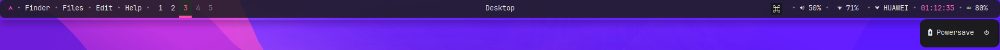
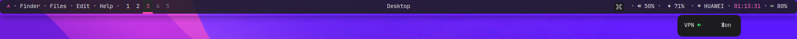

# A Simple Polybar Conf

## Preview

- top bar


- bat pop up bar



- net pop up bar



## Usage

```sh
~/.config/polybar/launch.sh
```

## My dotfiles

[dotfiles](https://github.com/SydX-pages/dotfiles)
